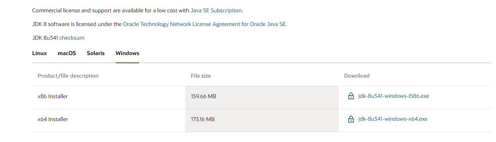

# 编译相关

## 1. 下载 JDK 环境

下载`JDK1.8 64位`环境，将`JDK`中的`JRE`复制到`build/jre`目录中。

[**JRE1.8 64位 Offline Installer**](https://www.oracle.com/java/technologies/downloads/#java8-windows)

## 2. Maven 编译 package

此为基础中的基础，不会的请合理运用搜索引擎查阅资料。

执行`package`后，`Maven`将自动使用`launch4j`打包为`QsBeanfun.exe`。

> 您也可以使用`exe4j`自行打包，记得把`Maven`中的`launch4j`插件注释掉就可以啦。

## 3. Inno Setup 打包安装程序

安裝`inno Setup`工具，运行`install-script.iss`，点击`Run`即可打包出安装包。

脚本内请查阅官方自行修改值，如果是没变动过目录情况下一般不需要变更，直接执行即可。

安装包打包好后，可使用`Resource Hacker`修改`manifest`为安装包赋予管理员权限。